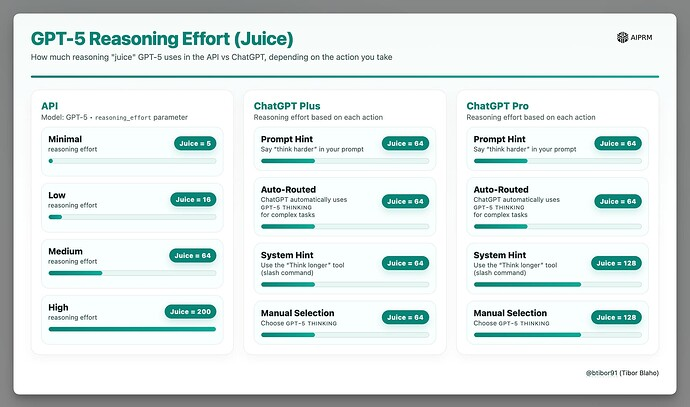

# AutoThinkSuffix for GPT-5 (MV3)

  https://github.com/user-attachments/assets/e010c674-f760-497d-afaf-000595479c7a

  

Make ChatGPT use reasoning mode consistently without burning GPT‑5 “thinking” quota. This extension appends a tiny hint (default: ` think harder`, optional: ` think longer`) only at send‑time on `https://chatgpt.com/*`, so you can leverage the official GPT‑5 automatic routing behavior while keeping normal typing intact.

Note: This tool does not modify servers or requests; it only edits the text in your input box right before you send it.

## Purpose (User‑friendly)
- Goal: Use “reasoning mode” via GPT‑5 automatic routing on the official site while avoiding unnecessary GPT‑5 thinking‑quota consumption.
- How: Append a minimal suffix at the moment you send. If routing prefers reasoning, the site switches modes; otherwise, standard mode is used. Your typing experience and shortcuts stay the same.

## What It Does
- Appends exactly one suffix at send‑time: choose ` think harder` (default) or ` think longer`.
- Works with both Enter‑to‑send and the Send button; respects Shift+Enter for newlines.
- Never changes text while you’re typing; only on send.
- Operates only on `https://chatgpt.com/*` with minimal permissions and zero data collection.

## Install (Developer Mode)
1. Open Chrome and go to `chrome://extensions`.
2. Enable “Developer mode”.
3. Click “Load unpacked” and select this folder.
4. (Optional) Pin the extension. Use the popup to enable/disable and choose the suffix.

## Use
- Open `https://chatgpt.com/` and type your message.
- Press Enter or click Send → your message is sent with the selected suffix exactly once.
- Press Shift+Enter to add a newline (no sending, no suffix yet).
- Already ends with ` think harder` or ` think longer`? It won’t add another.

## Privacy & Permissions
- Permissions: `storage` only (to remember Enable/Disable and your chosen suffix).
- No analytics, no remote code, no external network requests.
- No logging or transmitting of your messages. Everything runs locally as a content script.

## Troubleshooting
- Not working? Refresh the ChatGPT tab after installing/updating.
- If another extension also edits the prompt, temporarily disable it to compare.
- Still stuck? Try toggling the extension off/on in the popup and reloading the page.

## Files
- `manifest.json` — MV3 manifest, minimal permissions.
- `content.js` — Core logic: robust selectors, idempotent suffixing, Enter vs Shift+Enter, MutationObserver, React‑safe updates.
- `popup.html`, `popup.js` — Enable/Disable toggle and suffix choice (` think harder` or ` think longer`, default: ` think harder`).
- `LICENSE` — MIT License.
